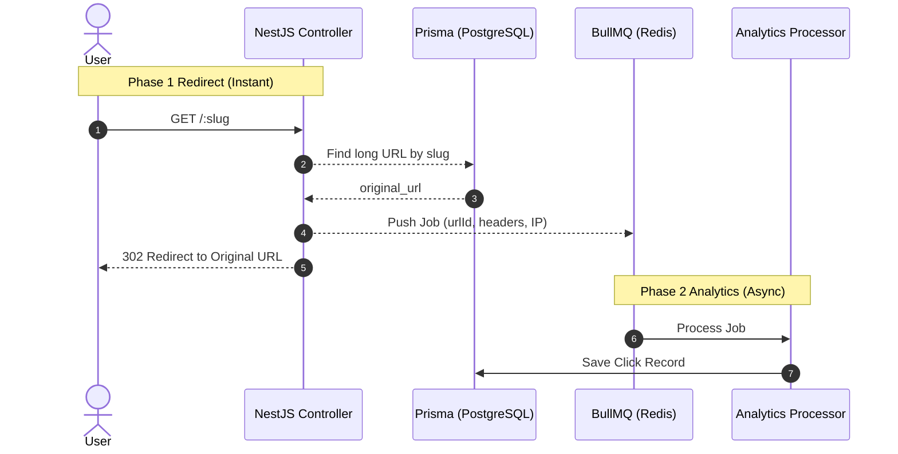

# URL Shortener Backend
This is a pet project to learn NestJS and build a product that can shorten URLS and also record the relavant data for users who visit shortened URLs.

### Overview:

```mermaid
sequenceDiagram
  autonumber
  actor User
  participant API as NestJS Controller
  participant DB as Prisma (PostgreSQL)
  participant Redis as BullMQ (Redis)
  participant Worker as Analytics Processor

  Note over User, API: Phase 1 Redirect (Instant)
  User->>API: GET /:slug
  API-->>DB: Find long URL by slug
  DB-->>API: original_url
  API-->>Redis: Push Job (urlId, headers, IP)
  API-->>User: 302 Redirect to Original URL

  Note over Redis, Worker: Phase 2 Analytics (Async)
  Redis->>Worker: Process Job
  Worker->>DB: Save Click Record
```
